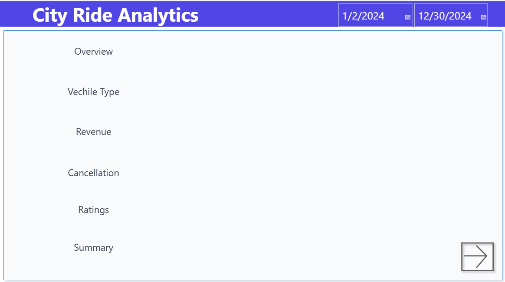

# Ride Analytics Dashboard | Power BI

## Overview
This project is a Power BI dashboard built using a ride booking dataset. The dashboard analyzes booking trends, revenue performance, ride cancellations, and customer behavior to understand overall business performance.

The project was created to practice data analysis, dashboard design, and data visualization using Power BI.

---

## Tools & Technologies
- Power BI
- DAX
- CSV Dataset

---

## Features
- Interactive dashboard with filters and slicers
- Booking analysis by vehicle type
- Revenue and performance tracking
- Ride cancellation analysis
- Time-based booking trends
- Customer behavior insights

---

## Project Structure

data/ → Dataset files  
dashboard/ → Power BI dashboard file  
images/ → Dashboard screenshots  

---

## Dashboard Preview

---

## Key Insights
- Booking activity is higher during evening hours
- Some vehicle categories generate more revenue than others
- Cancellation trends vary based on ride timing and booking conditions
- Customer demand changes across different time periods

---

## Files Included
- Ride_Analytics_Dashboard.pbix
- rideBookings.csv

---

## What I Learned
- Data cleaning and transformation
- Creating DAX measures and KPIs
- Building interactive dashboards in Power BI
- Data visualization and storytelling
- Business data analysis

---

## Use Case
This dashboard can help understand ride booking trends and support decision-making related to:
- Peak hour management
- Revenue optimization
- Cancellation monitoring
- Customer behavior analysis
